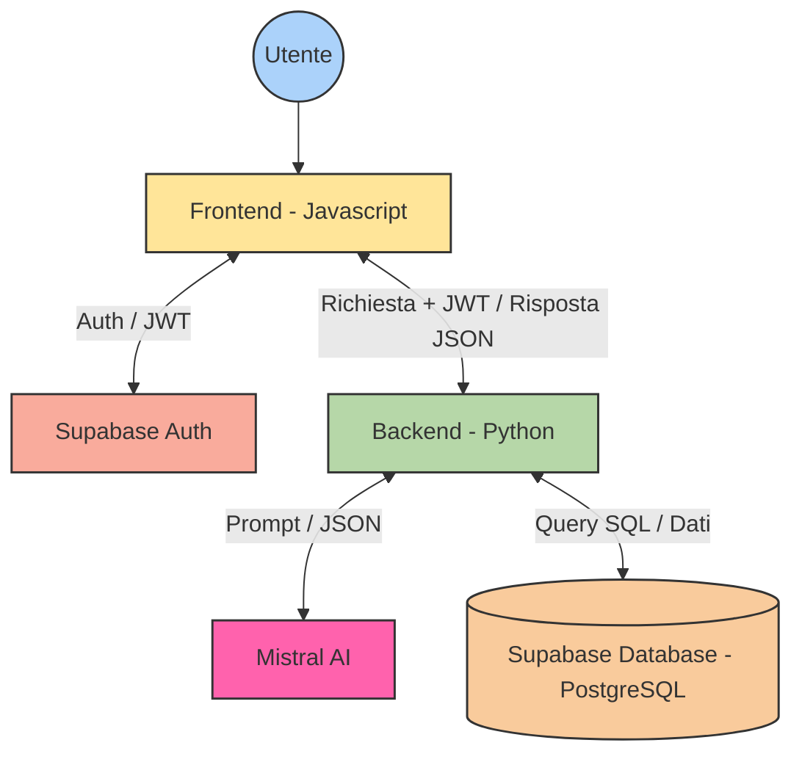

# Stonks Manager <!-- omit in toc -->

Stonks-Manager è una semplice app finanziaria che permette il controllo dei propri movimenti giornalieri. Permette di salvare i movimenti categorizzandoli opportunamente e assegnandoli ai dovuti conti di appartenenza. 

Stonks-Manager permette anche funzioni di inserimento intelligente dei movimenti questo è possibile in due modi:
- sia via linguaggio umano ad esempio: "Ho mangiato una pizza con Luca sabato e ho speso 15 euro"
- sia via scansione automatica della foto di uno scontrino
L'IA poi restituirà le informazioni nuovamente all'app che mostrera un form già compilato per la revisione dei dati inseriti.


## Tabella dei contenuti <!-- omit in toc -->

- [Configurazione](#configurazione)
  - [1. Clonazione e accesso al progetto](#1-clonazione-e-accesso-al-progetto)
  - [2. Creazione e attivazione dell'ambiente virtuale di Python](#2-creazione-e-attivazione-dellambiente-virtuale-di-python)
  - [3. Installazione delle dipendenze](#3-installazione-delle-dipendenze)
  - [4. Configurazione delle variabili di ambiente](#4-configurazione-delle-variabili-di-ambiente)
  - [5. Configurazione del database](#5-configurazione-del-database)
- [Esecuzione dell'applicazione](#esecuzione-dellapplicazione)
  - [Avvio dell'API backend](#avvio-dellapi-backend)
  - [Avvio del server frontend (in un nuovo terminale)](#avvio-del-server-frontend-in-un-nuovo-terminale)
- [Task disponibili](#task-disponibili)
- [Architettura e struttura del progetto](#architettura-e-struttura-del-progetto)
  - [Il database](#il-database)
  - [Il backend](#il-backend)
  - [Il frontend](#il-frontend)
- [Note di sviluppo](#note-di-sviluppo)
- [Risoluzione dei problemi](#risoluzione-dei-problemi)


## Configurazione

> [!NOTE]
> Prima della clonazione è necessaria l'installazione di [Python](https://www.python.org/downloads/release/python-3132/) (con pip) e [Git](https://git-scm.com/install/) 


### 1. Clonazione e accesso al progetto

```bash
git clone <repository-url>
cd Stonks-Manager
```

### 2. Creazione e attivazione dell'ambiente virtuale di Python

**Windows (PowerShell):**
```powershell
python -m venv .venv
.\.venv\Scripts\Activate.ps1
```

**Linux/macOS:**
```bash
python3 -m venv .venv
source .venv/bin/activate
```

### 3. Installazione delle dipendenze

```bash
pip install -r requirements.txt
```

### 4. Configurazione delle variabili di ambiente

Crea un file `.env` nella radice del progetto o rinomina il file già esistente [.env.example](./.env.example). Sostituisci poi i valori con le tue credenziali e valori. 


### 5. Configurazione del database

Se è la prima volta che esegui il progetto, inizializza il database Supabase eseguendo gli script SQL nella cartella `database/` in questo ordine:

1. `schema.sql` - Crea le tabelle principali
2. `default_categories.sql` - Popola le categorie di transazione predefinite
3. `local_auth_setup.sql` - Configura l'autenticazione locale (SOLO per database locali)

## Esecuzione dell'applicazione

L'applicazione è costituita da due server che devono essere eseguiti contemporaneamente:


### Avvio dell'API backend

**Windows:**
```powershell
invoke runBack
```

**Linux/macOS:**
```bash
invoke runBack
```

Questo avvia il server FastAPI su [http://localhost:8000](http://localhost:8000)


### Avvio del server frontend (in un nuovo terminale)

**Windows:**
```powershell
invoke runFront
```

**Linux/macOS:**
```bash
invoke runFront
```

Questo serve il frontend su [http://localhost:3000](http://localhost:3000)


## Task disponibili

Il progetto utilizza Invoke per l'automazione delle attività. Esegui uno di questi comandi dalla radice del progetto:

**Esegui il server backend:**
```
invoke runBack
```

**Esegui il server frontend:**
```
invoke runFront
```

**Esegui i test delle route:**
```
invoke routeTest
```

Testa tutti gli endpoint API. Passa flag facoltativi:
- `--jwt` - Recupera solo il token JWT senza eseguire i test
- `--no-cleanup` - Salta la pulizia dei dati di test dopo i test
- `--keep-user` - Mantieni l'utente di test dopo i test

Esempio:
```
invoke routeTest --keep-user
```

**Pulisci la cache:**
```
invoke clean
```

Rimuove le cartelle `__pycache__` e i file `.pytest_cache`.

**Verifica i segreti nella cronologia di Git:**
```
invoke checkLeaks
```

Verifica che nessuna variabile di ambiente da `.env` sia presente nella cronologia di Git.


## Architettura e struttura del progetto

Il progetto si suddivide in tre parti principali: database, backend e frontend. Diagramma rappresentativo in [`high-level-architecture.md`](./docs/high-level-architecture.md) (oppure riportato quà sotto).



Il flusso generale dell'applicazione è:
1. Validazione dell'utente da parte del frontend: Il frontend ottiene il JWT da Supabase
2. Dopo aver ottenuto il JWT il frontend effettua tutte le chiamate necessarie alle rotte del backend (creazione, ottenimento, modifica, eliminazione)
3. Il backend poi interpreterà la richiesta del client e la soddisferà (query su database o uso AI) 
4. Infine il frontend otterrà i dati richiesti e li interpreterà

### Il database

Il database è ospitato su Supabase contiene quattro entità principali:
- `user_profile`: Entità che raggruppa un insieme di persone fisiche registrate
- `account`: Entità che raggruppa un insieme di movimenti correlati
- `transaction`: Entità che rappresenta una transazione
- `category`: Entità che raggruppa un insieme di movimenti correlati. Può essere predefinita o creata dall'utente

Per un riferimento grafico ecco lo [schema E-R](https://docs.google.com/drawings/d/17DGczBNJ1Bi9Ii_ux6JzthXio1NgncwWv75dBQOGBaA/edit?usp=sharing) creato in fase di progettazione del database:


### Il backend 

Il backend in Python è suddiviso in tre "packages" principali:
- `models`: dichiara tutti i modelli delle tabelle nel database oltre che quelli che le richieste HTTP devono rispettare
- `routes`: definisce le rotte per la gestione delle entità del database 
- `services`: contiene l'implementazione della logica di ogni singola rotta

A servizio di questi packagers principali ci sono anche:
- `utils`: che contiene varie utilità quali `getCurrentUser` ad esempio che permette l'ottenimento dell'identificativo di un utente dopo un controllo della validita del JWT
- `config`: che contiene alcuni parametri di configurazione come rate-limits, modelli specifici di IA da usare o prompt i prompt di sistema per l'IA


### Il frontend

Dal punto di vista organizzativo suddiviso per: pagine, script e stili. Contiene tutto il codice necessario al funzionamento della UI, inclusa la logica di comunicazione con il backend con previo ottenimento del JWT. 

La UI è suddivisa in varie pagine:
- **Dashboard**: è la pagina principale dell'app con il calcolo del saldo dei conti inclusi nel saldo generale e un grafico che mostra entrate e uscite delle rispettive categorie
- **Transazioni**: la pagina dove è possibile consultare, modificare ed eliminare tutte le transazioni inserite
- **Categorie**: una pagina dedicata alla gestione delle categorie (default e non)
- **Conti**: la pagina dedicata alla gestione dei conti con possibilità di modifica ed eliminazione oltre che al calcolo del saldo tra conti selezionati
- **Profilo**: ovvero la pagina di gestione del profilo utente
- **Informazioni**: informazioni generali sull'applicazione e sulle risorse utilizzate


## Note di sviluppo

- Il backend API viene eseguito sulla porta 8000
- Il server frontend viene eseguito sulla porta 3000
- Le variabili di ambiente vengono caricate da `.env` utilizzando il percorso relativo dalla radice del progetto
- Le query del database utilizzano la libreria client Supabase
- La suite di test richiede credenziali Supabase valide in `.env`


## Risoluzione dei problemi

**Errore "User already exists" nei test:**
Usa `invoke routeTest --keep-user` alla prima esecuzione, quindi riutilizza lo stesso utente per i test successivi.

**Variabili di ambiente mancanti:**
Assicurati che tutte le variabili richieste in `.env` siano impostate. L'app genererà un errore elencando le variabili mancanti.

**Porta già in uso:**
Se la porta 8000 o 3000 è già in uso, modifica i file di configurazione del server pertinenti per utilizzare porte diverse.

**Rate-limit:**
Dopo svariate richieste consecutive è possibile si vada in contro al raggiungimento del rate-limit del backend in tal caso ci si può trovare davanti a errori come "Errore AI: Si è verificato un problema".


