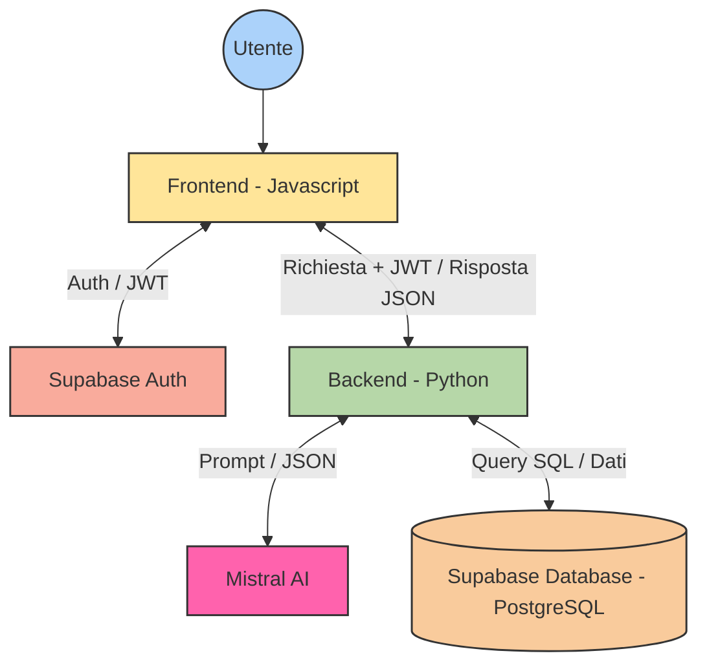

```mermaid
flowchart TD
    User((Utente)) --> Frontend[Frontend - Javascript]
    Frontend <-->|Auth / JWT| Auth[Supabase Auth]
    Frontend <-->|Richiesta + JWT / Risposta JSON| Backend[Backend - Python]
    Backend <-->|Prompt / JSON| AI[Mistral AI]
    Backend <-->|Query SQL / Dati| Database[(Supabase Database - PostgreSQL)]

    style Frontend fill:#FFE599,stroke:#333,stroke-width:1.5px
    style Backend fill:#B6D7A8,stroke:#333,stroke-width:1.5px
    style Database fill:#F9CB9C,stroke:#333,stroke-width:1.5px
    style Auth fill:#F9AB9C,stroke:#333,stroke-width:1.5px
    style User fill:#ABD2FA,stroke:#333,stroke-width:1.5px
    style AI fill:#FF62AD,stroke:#333,stroke-width:1.5px
```